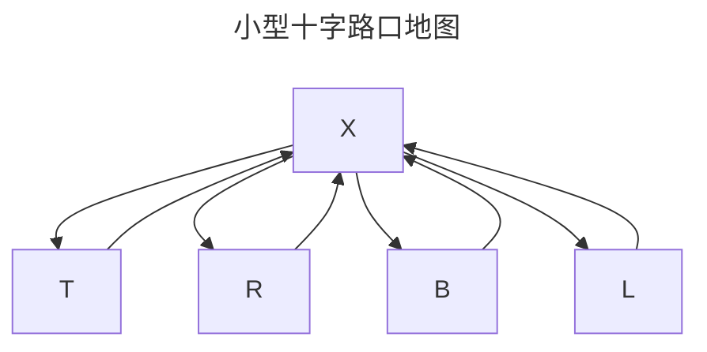
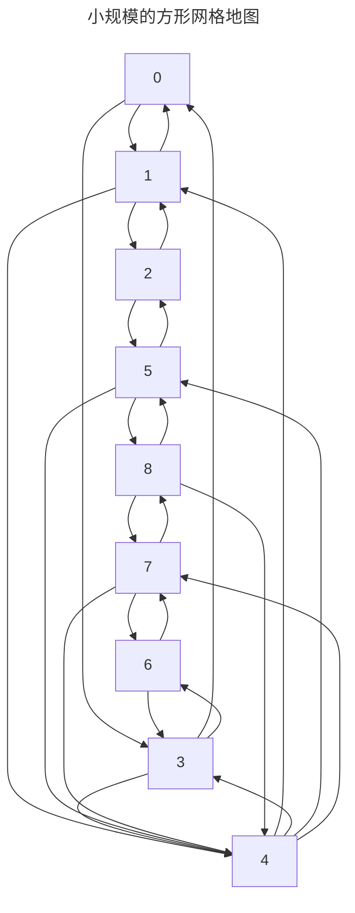

TODO: 全文需要20000个字。

# 摘要

TODO：至少500个字，研究背景、目标、内容、方法、工作的特色。

在现代化的工厂和仓库中，常使用 AGV 来运输货物，研究 AGV 的调度和路线规划算法非常的有意义。
本文工作目的不仅是要探究 AGV 调度系统的设计与实现以及达到吉林大学毕业论文的要求，而且更重要的是要让作者可以取得本科文凭和毕业证，这对于提高求职者的竞争力是相当的重要的。
研究内容就是做一个 AGV 调度器的模拟仿真程序，调度器的输入为货物运输任务的列表，输出为 AGV 每个时刻的位置和移动情况，根据笔者的时间精力和技术水平可以做一定的简化和抽象。
研究方法是编码实现与上机实验相结合，以编码实现为主、阅读文献为辅。
编码实现中，笔者使用的是 TypeScript 程序设计语言，这是 JavaScript 程序设计语言的一种带有类型提示的超集，这两种程序设计语言都被广泛应用在现代 web 应用程序的开发中，采用这种程序设计语言是因为笔者比较熟悉，使用起来比较方便，工具链比较完善，这个语言生态系统中有主流的代码格式自动整理器、代码静态检查工具、软件包管理工具、单元测试框架等。具体而言，研究方法就是编写代码、编写单元测试、运行单元测试，按照单元测试中失败的用例调整代码或者反复核对单元测试编写没有纰漏，如此往复，直到单元测试都通过且代码实现了需要的功能。
研究成果是设计了一个 AGV 调度和路线规划的模拟仿真程序，可以自动的生成货物运输任务，然后把这些任务指派给 AGV ，然后再逐一对每个 AGV 指挥其走行，经过在不同规模地图的实验，本系统可以保证 AGV 不相撞，并能高效的完成货物运输任务。具体而言是编写了将近1000行的 ts 代码，这些包括支撑本文实验的代码，以及代码的单元测试，单元测试使用 vitest 自动运行，这些测试具有典型性，可以保证程序的正确性。
此外，作者也在这个过程中增加了编码经验提高了编码工具使用熟练度。

English abstract will be added after revisions.

**关键词：**AGV、路线规划、最短路径算法

# 研究背景

TODO：此处写多一点字，字数要够多。

美国、日本及一些欧洲国家是柔性制造技术发展的领跑者，他们对该技术的研究和使用最早从上个世纪六十年代就开始了。自从美国马萨诸塞理工学院在1952年开发出全球首台由计算机数字电子系统控制的铣床以来，柔性自动化生产已经过了近八十年的发展。到了1967年英国的莫林斯制造公司开发设计了“System 24”，可以用来控制六台多功能的机床，其名称中的“24”，意指昼夜不停不间断的意思，表示该系统可以控制这些机床连续地加工。同年，美国的森斯特兰公司建成Omniline I系统，这台系统能够把固定在流水线上沿流水线移动的工件送往多台数字控制的加工中心，进行多种不同加工程序，这被称为是第一台实际投入使用的柔性自动线。在上个世纪七十年代，多家日本加工制造企业研发出了自己的柔性自动化生产线，如日立精机、发那科公司。到了上个世纪80年之后，随着计算机技术的快速发展，柔性制造技术也有了很大的进步，尤其是自动化的程度。

在我国，柔性制造系统是从上世纪八十年代被引入我国的。一开始以引入外国企业设计生产的整机为主，到九十年代初，我国企业自行研发的的柔性制造系统也开始投入到实际生产当中。2004年，中科院力学研究所设计并实现了智能化、模块化的柔性加工系统，其带有数字化的信息处理系统，集成化的控制管理系统，是当时重要的技术突破之一，其核心是激光加工制造与智能化加工的有机结合。尽管柔性制造系统的研究和制造在我国起步较晚，但我国近几十年来的制造业都处于快速发展时期，我国相关研发人才群体处于快速积累的时期，这段时期我国国内自助设计和独立开发的柔性制造系统有了很大的创新和突破。

到了新世纪，客户需求变得更加多样化和个性化，这让生产制造企业不得不转变生产模式，必须开发出一种可以开发多品种商品的、生产批量可变的生产模式。而这种生产模式就必须要求生产制造车间极大地提高柔性，来适应复杂多变的产品需求，生产系统的复杂程度也会随之快速增加。生产系统的复杂程度主要体现在：物流任务多、流程变化大、生产混流、转产换线频繁。自动导引车（Automated Guided Vehicle）的自动化、高柔性、高效率和并行作业性可以很好地满足其中的物流需求。一种由多AGV组成的物流系统正在成为实现物流自动化、配送柔性化过程中的关键组件。

# 研究现状

TODO：这里写其他人写的论文，要10篇，3000个字。

[@SL18]提出了一个集成了交通量、平均速度、绝对拥堵指数（ACI）和相对拥堵指数（RCI）等关键拥堵指标的拥堵监控系统（CMS），用于实时量化和监控半导体制造自动化物料搬运系统（AMHS）中的拥堵情况。
通过实际案例分析和模拟实验，验证了CMS在监控、优化路径分配和增强路由算法方面的有效性，展示了其在减少平均交付时间和缓解生产损失方面的显著效果。
[@Fransen20]使用图表示法来表示网格系统布局，并随时间更新顶点权重。
顶点权重通过指数平滑法进行更新，反映 AGV 在中心点的停滞时间。当 AGV 离开中心点时，系统记录其停滞时间，并用此来更新相应顶点的权重。
此外，如果 AGV 在中心点停滞时间超过顶点权重当前值，则会进行初步更新，提前增加顶点权重。
这种动态规划路径的方法能在拥挤的 AGV 系统显著提高系统吞吐量。
[@zhang16]使用了时间窗用于确保 AGV 在规划路径上行驶时，不会与其他 AGV 或系统内的其他活动发生冲突，进而在路径规划过程中，如果发现当前路径上的某个点的时间窗已被占用，算法会重新规划路径，避开冲突，并更新时间窗信息。
[@li23]考虑了包括空载和重载状态下的 AGV 运行成本在内的多个维度的避障成本，进而让避障成本低的避让避障成本高的 AGV ，并以此为启发式来改进A\*算法[@Hart1968]优化了路径规划过程，本文用的是栅格化地图模型。
[@Tang21]也对A\*算法做了调整来适应用网格建模的地图，首先是从A\*算法的 `open-list` 中选择了欧几里得距离作为启发式函数，以更准确地反映节点间的实际距离。与传统的曼哈顿距离相比，欧几里得距离能够提供更短、更直接的路径，从而提高了路径规划的效率，并选择了欧几里得距离作为启发式函数，以更准确地反映节点间的实际距离。与传统的曼哈顿距离相比，欧几里得距离能够提供更短、更直接的路径，从而提高了路径规划的效率，最终提高了路径规划的效率和平滑度。
[@zhang23]在货物运输任务和 AGV 的分配上做了研究，把任务和 AGV 的分配问题抽象成了一对多双边匹配问题，并使用改进的匈牙利算法来解决，传统的匈牙利算法[@liu23]在初始效率矩阵中进行多次变换，可能会增加计算时间，而该文献中提出的改进匈牙利算法通过最大贪心策略优化了这一过程，提高了计算效率，为实现AGV总行驶距离最短的目标奠定了基础。

# 系统整体设计与实现

本系统的所有源代码都由基于 git 的代码托管平台 GitHub 公开托管于 [https://github.com/li6in9muyou/ungr-dstt](https://github.com/li6in9muyou/ungr-dstt)，其修改历史都也在平台上公开可查。

## 概述

本文设计了一个 AGV 调度和路线规划的模拟仿真程序，可以自动的生成货物运输任务，然后把这些任务指派给 AGV ，再逐一对每个 AGV 指挥其走行，经过在不同规模地图的实验，本系统可以保证 AGV 不相撞，并能高效的完成货物运输任务。
模拟仿真结束后将统计 AGV 的运行数据和货物运输任务的数据，这些指标包括：

- 任务到达时刻与开始运输的时间差，即任务执行延迟。
- 任务开始运输到运输完毕的时间差，即任务运输时间。
- 任务到达时刻到运输完毕的时间差，即任务周转时间。
- AGV 因下一个路径点有其他 AGV 而不能前进的时间之和，即 AGV 堵车时间。
- AGV 接到任务后去往货物运输任务运送始发地的时间，即 AGV 取货时间。
- AGV 从货物运输任务运送始发地前往运送终到地的时间，即 AGV 送货时间。

对于每一个指标，进一步计算数字特征，包括最大值、最小值、平均值。
这些指标和指标的数字特征能够刻画本 AGV 调度系统的性能。
系统开始时，模拟仿真控制器先按照配置初始化地图、 AGV 的数量和初始位置以及货物运输任务表。然后采用离散时间模拟法，每个时间片都命令 AGV 调度器对 AGV 执行调度，然后让各 AGV 更新各自的状态，直到所有的任务都被完成，完成之后统计上述统计数据，并打印每台 AGV 的路径信息。
本文用 typescript 程序设计语言，用 nodemon、npm、vitest、vite 等现代化主流 web 开发工具链开发，文本编辑器使用 neovim 。

## 主要组成部分

### 地图模型

有向图是一种图论中的结构，由一组顶点（或称为节点）和一组有序的边组成。
在有向图中，每条边都有一个明确的起点和终点，边的方向是从起点指向终点，这种边也被称为弧或有向边。
因为有向边的方向性，有向图能够表示事物之间的单向关系，如流程、命令链或者依赖关系。
连通性是图的一个基本属性，指的是在无向图中任意两个顶点之间都存在至少一条路径，使得可以从一个顶点到达另一个顶点。
在有向图中，连通性的概念稍有不同，它通常指的是强连通性，即图中的任意两个顶点之间都存在双向的路径——从一个顶点可以到达另一个顶点，反之亦然。
连通性是评估图的网络结构是否完整、是否存在孤立部分的重要指标，对于确保图中的信息或资源能够流通至关重要。

在自动引导车（AGV）路径规划的研究中，地图的抽象化处理是一种常见的方法，它将复杂的实际环境简化为易于处理的数学模型。
具体来说，地图被抽象为一个有向图，这种表示方法不仅简化了路径搜索过程，而且通过引入方向性，能够更准确地模拟 AGV 在实际环境中的移动。
在这个有向图中，每条边的权重目前都被设定为1，这意味着每一段路径或每一段移动的代价是相同的，无论是直线行驶还是转弯。
这样的设计简化了算法的复杂性，同时保证了图的连通性，确保了从起点到终点的路径是存在的。

在这个抽象的有向图中，每个节点被赋予了一个独一无二的标识符，即 id。
这个 id 是节点的唯一标识，它不仅帮助算法追踪和识别特定的节点，而且在路径规划中起到了关键作用。
通过节点 id，算法能够确定 AGV 的当前位置和目标位置，以及它们之间的路径关系。

此外，每个地图节点在设计时都考虑了对 AGV 的容纳能力。
目前，在这个模型中，每个节点被设计为仅能容纳一辆 AGV。
这样的设计选择反映了对 AGV 运行效率和路径规划复杂性的平衡。
限制每个节点只能容纳一辆 AGV 可以避免节点处的拥堵和冲突，确保了路径规划的清晰性和可管理性。
然而，这种设计也意味着 AGV 在到达一个节点后，必须迅速离开以让位给后续的 AGV，这就需要一个高效的路径规划和调度系统来支持。

在实际应用中，这种地图抽象和节点设计的方法为 AGV 的路径规划提供了一个清晰和有序的框架。
它不仅使得路径搜索算法能够高效地运行，而且也便于系统监控和维护 AGV 的运行状态。
随着技术的进步和需求的变化，这种抽象模型还可以进一步扩展和优化，例如通过调整边的权重来反映不同的行驶条件，或者增加节点的容纳能力以适应更大规模的 AGV 系统。

总之，
地图被抽象为有向图，目前边的权重均为1，且保证是连通图。
每个节点有一个唯一的 id 。
每个地图节点都可以容纳一定量的 AGV ，目前节点都是只能容纳1个 AGV 。

### 货物模型

在自动引导车（AGV）系统的路径规划和货物运输管理中，对货物的抽象化处理是实现高效调度策略的基础。在这种抽象模型中，每一项货物运输任务被表示为一个三元组，包含三个关键信息：运送始发地、运送终到地以及运输任务到达时间。

1. 运送始发地和运送终到地：这两个地点在模型中被表示为地图上的节点，每个节点拥有一个独一无二的标识符，即 id。这个 id 不仅作为节点的索引，也作为地图上位置的一个编码，使得 AGV 能够准确地识别和导航至这些地点。在实际应用中，这些节点可能代表仓库中的特定货架、装货区或卸货区。

2. 运输任务到达时间：这个参数以系统模拟的轮次序号来表示，它反映了货物运输任务在系统中生成的具体时间点。这个时间戳对于调度算法来说至关重要，因为它决定了任务的优先级和 AGV 的调度顺序。

在这样的系统模型中，任何一个货物运输任务都可以被任何一个 AGV 承载。这意味着 AGV 系统设计为灵活调度，任何可用的 AGV 都可以根据当前的任务分配和路径规划结果，被指派去执行特定的运输任务。

此外，货物运输任务一旦产生，系统就假定它必须被 AGV 运输完毕。这种设计忽略了任务超时或中途取消的情况，从而简化了路径规划和调度算法的复杂性。这种假设适用于那些对运输可靠性和准时性有严格要求的场景，确保了货物运输的连续性和系统运行的稳定性。

然而，这种简化的模型在现实世界的应用中可能需要进一步的扩展和细化。例如，在实际的物流系统中，可能需要考虑任务的动态取消、 AGV 的故障处理、路径的重新规划以及运输时间的优化等复杂因素。未来的研究可以探索如何在保持系统高效运行的同时，增加对这些现实世界因素的适应性和鲁棒性。通过不断的技术创新和算法优化， AGV 系统将能够更好地满足现代物流和制造行业的复杂需求。

总之，
货物被抽象为三元组，（运送始发地，运送终到地，运输任务到达时间）。
其中运送始发地和运送终到地以地图节点的 id 来表示，运输任务到达时间以系统模拟轮次序号表示。
任何一个货物运输任务都可以被任何一个 AGV 承载。
货物运输任务一旦产生就一定要被 AGV 运输完毕，不处理任务超时或中途取消的情况。

### AGV 模拟器

在本模拟系统中，我构建了一个抽象的自动导引小车 AGV 模型，以便于研究和优化其在物流和仓储自动化中的性能。
每台AGV在模拟环境中都被视为一个独立的智能体，它们在虚拟仓库地图上执行具体的搬运任务。
在本模拟系统中， 每台 AGV 都占用一个地图节点。

每台 AGV 被建模为一个简单但功能完备的数据对象，该对象封装了AGV的关键信息和行为。这些关键信息包括：

- 位置：AGV 在地图上的位置通过节点的ID来表示，每个节点具有唯一的标识符，确保了 AGV 定位的精确性。
- 载货状态： AGV 的载货状态用布尔值来表示，值为真时表示 AGV 为空载，值为假时，表示 AGV 为满载。
- 货物信息：如果 AGV 处于载货状态，该对象持有有关所载货物的详细信息的引用，也就是前文所述的货物三元组。

AGV的运输任务和行为如下：

1. 任务指派：调度程序负责将货物运输任务分配给AGV。这些任务由 AGV 调度程序分配。
2. 路线规划：一旦 AGV 接到任务，它会根据预设的路线规划程序计算出最优路径，并在地图中自主导航。
3. 任务执行：AGV的任务执行又包括以下几个阶段的子任务：
   1. 取货阶段：在此阶段，AGV会进行路径规划，使用的是下文描述的路径规划算法， AGV 将从当前位置去往货物的运送始发地。
   2. 送货阶段： AGV 将从货物的运送始发地前往货物的运送终到地，同样使用的是下文描述的路径规划算法。

### AGV 调度程序

该子系统负责将货物运输任务指派给 AGV 。
货物运输任务的指派算法如下：

算法输入：

- AGV 集合
- 货物运输任务集合

算法输出：

- 任务指派集合 schedule ，其中的元素为（AGV， 指派给 AGV 的运输任务）。

算法终止条件：

- AGV 集合中所有 AGV 都有载货。
- 或者，货物运输任务集合为空。

算法步骤：

1. 从所有的 `AGV` 中选出那些没有载货的 `AGV` ，装入集合 `idleAGVs` 。
2. 把任务队列中的任务按照任务到达的先后顺序排序，装入列表 `tasks`。
3. 从 `tasks` 中取出任一任务，记为 `task` ，从 `idleAgvs` 中取出任一 AGV ，记为 `AGV` 。将元组（AGV，task）装入集合 schedule 中。

### AGV 路线规划算法

算法输入：两个地图节点，用其 id 表示。

算法输出：地图节点列表，用其 id 表示。保证该列表开头和最后一个元素为输入的两个节点，若没有路径，输出控列表。

算法步骤：[@Dijkstra1959]描述的最短路径算法

### AGV 走行控制算法

该子系统负责控制每台 AGV 的走行。

算法输入：

- AGV
- 系统模拟轮次序号

算法输出：AGV 的下一个位置，用地图节点 id 表示。

算法步骤：

1. 若 AGV 未被指派运输任务，输出当前位置，结束。
2. 若 AGV 被指派了运输任务却没有载货，记 `Path` 为 AGV 路线规划算法（当前位置，被指派的货物运输任务的运送始发地）的输出，若 `Path[1]` 没有 AGV 占用，输出 `Path[1]` ，否则输出当前位置，结束。
3. 若 AGV 被指派了运输任务且载货，记 Path 为 AGV 路线规划算法（当前位置，被指派的货物运输任务的运送终到地）的输出，若 `Path[1]` 没有 AGV 占用，输出 `Path[1]` ，否则输出当前位置，结束。

### 仿真模拟器

本模块是将前述各模块整合的关键模块，其主要算法如下：

算法输入：模拟轮次上限

算法输出：AGV 运行情况统计、货物运输任务完成情况统计

算法步骤：

1. 把当前模拟轮次 elapsed 设为0。
2. 调用前述 AGV 调度程序给 AGV 分配货物运输任务
3. 让每一个 AGV 对象更新一次自己的状态
4. 收集 AGV 对象的当前位置和他们的状态
5. 把 elapsed 增加1，如果 elapsed 等于模拟轮次上限则算法结束，否则回到步骤2。

综上，这个仿真模拟器在算法主循环中调用其他子系统，让货物运输任务生成器生成新的任务、让 AGV 调度程序给各闲置的未有载货的 AGV 指派任务、驱动 AGV 改变自身的状态。

# 实验结果

## 小型十字路口地图

地图对一十字路口进行建模，更具体地，该地图共有5个节点，依次记为：`X`、`T`、`R`、`B`、`L`，节点之间的边按照如下算法生成：

1. 在 `X` 和 `T` 之间创建一条边。
2. 在 `X` 和 `R` 之间创建一条边。
3. 在 `X` 和 `B` 之间创建一条边。
4. 在 `X` 和 `L` 之间创建一条边。

该地图示意图如下



货物运输任务的生成算法如下：

1. 生成一个货物运输任务`(T, L, 1)`。
2. 生成一个货物运输任务`(B, R, 2)`。

AGV 初始配置如下：

| 编号 | 初始状态           | 位置（地图顶点的编号） |
| ---- | ------------------ | ---------------------- |
| 3001 | 不载货、未指派任务 | T                      |
| 3002 | 不载货、未指派任务 | B                      |

输出 AGV 控制信息如下：

```
agv-3001 idle at location 1001
agv-3002 idle at location 1003
agv-3001 assigned: 1001 ~~> 1004
agv-3002 assigned: 1003 ~~> 1002
agv-3001 1001->1000
agv-3002 1003->1003 // *
agv-3001 1000->1004
agv-3002 1003->1000
agv-3001 job arrived 1 completed 3
agv-3002 1000->1002
agv-3001 idle at location 1004
agv-3002 job arrived 1 completed 4
agv-3001 idle at location 1004
agv-3002 idle at location 1002
```

可以看到在 \* 行时，编号为3002的 AGV 等待了一个仿真模拟时间片，给编号为3001的 AGV 让行。

输出货物运输任务的完成情况的统计信息如下：

| 指标名称     | 最小值 | 平均值 | 最大值 |
| ------------ | ------ | ------ | ------ |
| 任务执行延迟 | 0      | 0      | 0      |
| 任务运输时间 | 2      | 2.5    | 3      |
| 任务周转时间 | 2      | 2.5    | 3      |

输出 AGV 走行数据的统计信息如下：

| 指标名称 | 最小值 | 平均值 | 最大值 |
| -------- | ------ | ------ | ------ |
| 取货时间 | 0      | 0      | 0      |
| 送货时间 | 2      | 2.5    | 3      |

## 大型网格地图

地图对一方形网格地图进行建模，每个网格有上下左右四个相邻网格，更具体地，该地图共有100个节点，依次编号号为0到99，节点之间的边按照如下算法生成：

1. 把100个节点分为10组，每组10个节点，记组号取值为 0、1、2、3、4、5、6、7、8、9。组号为 `row` 的组，其中含有编号为 `10*row + col` （`col` 取值为 0、1、2、3、4、5、6、7、8、9 ）的节点。
2. 对于组号为 `row` 的组中的每个顶点的编号 id， 在 `id` 与 `id - 1` 、 `id` 与 `id + 1` 之间创建一条边，如果有顶点的编号不在该组内，则不创建。
3. 重新把节点分组，把100个节点分为10组，每组10个节点，记组号取值为 0、1、2、3、4、5、6、7、8、9。组号为 `col` 的组，其中含有编号为 `10*row + col` （`row` 取值为 0、1、2、3、4、5、6、7、8、9 ）的节点。
4. 对于组号为 `col` 的组中的每个顶点的编号 id， 在 `id` 与 `id - 10` 、 `id` 与 `id + 10` 之间创建一条边，如果有顶点的编号不在该组内，则不创建。

该用同样的方法生成的较小规模的方形网格地图示意图如下



货物运输任务的生成算法如下：

1. 初始化 `cnt` 为0。
2. 在每个模拟仿真时间片，记其序号为 `elapsed` ，从集合（0, 99, 90, 99）中随机选出两个数字，依次记为 `start` 、 `end` 。
3. 生成一个货物运输任务`(start, end, elapsed)`。
4. 若 `cnt` 等于6， 终止算法，否则回到步骤1。

AGV 初始配置如下：

| 编号 | 初始状态           | 位置（地图顶点的编号） |
| ---- | ------------------ | ---------------------- |
| 3000 | 不载货、未指派任务 | 14                     |
| 3001 | 不载货、未指派任务 | 25                     |

输出 AGV 控制信息如下：

| elapsed | agv-3001                   | agv-3002                   |
| ------- | -------------------------- | -------------------------- |
| 0       | idle at location 1014      | idle at location 1025      |
| 1       | assigned: 1009 ~~> 1090    | assigned: 1099 ~~> 1090    |
| 2       | 1014->1015                 | 1025->1026                 |
| 3       | 1015->1016                 | 1026->1027                 |
| 4       | 1016->1017                 | 1027->1028                 |
| 5       | 1017->1018                 | 1028->1029                 |
| 6       | 1018->1019                 | 1029->1039                 |
| 7       | 1019->1009                 | 1039->1049                 |
| 8       | 1009->1008                 | 1049->1059                 |
| 9       | 1008->1007                 | 1059->1069                 |
| 10      | 1007->1006                 | 1069->1079                 |
| 11      | 1005->1004                 | 1079->1089                 |
| 12      | 1004->1003                 | 1089->1099                 |
| 13      | 1003->1002                 | 1099->1098                 |
| 14      | 1002->1001                 | 1098->1097                 |
| 15      | 1001->1000                 | 1097->1096                 |
| 16      | 1000->1010                 | 1096->1095                 |
| 17      | 1010->1020                 | 1095->1094                 |
| 18      | 1020->1030                 | 1094->1093                 |
| 19      | 1030->1040                 | 1093->1092                 |
| 20      | 1040->1050                 | 1092->1091                 |
| 21      | 1050->1060                 | 1091->1090                 |
| 22      | 1060->1070                 | job arrived 2 completed 21 |
| 23      | 1070->1080                 | assigned: 1009 ~~> 1000    |
| 24      | 1080->1090                 | 1090->1091                 |
| 25      | job arrived 1 completed 25 | 1091->1092                 |
| 26      | assigned: 1009 ~~> 1090    | 1092->1093                 |
| 27      | 1090->1091                 | 1093->1094                 |
| 28      | 1091->1092                 | 1094->1095                 |
| 29      | 1092->1093                 | 1095->1096                 |
| 30      | 1093->1094                 | 1096->1097                 |
| 31      | 1094->1095                 | 1097->1098                 |
| 32      | 1095->1096                 | 1098->1099                 |
| 33      | 1096->1097                 | 1099->1089                 |
| 34      | 1097->1098                 | 1089->1079                 |
| 35      | 1098->1099                 | 1079->1069                 |
| 36      | 1099->1089                 | 1069->1059                 |
| 37      | 1089->1079                 | 1059->1049                 |
| 38      | 1079->1069                 | 1049->1039                 |
| 39      | 1069->1059                 | 1039->1029                 |
| 40      | 1059->1049                 | 1029->1019                 |
| 41      | 1049->1039                 | 1019->1009                 |
| 42      | 1039->1029                 | 1009->1008                 |
| 43      | 1029->1019                 | 1008->1007                 |
| 44      | 1019->1009                 | 1007->1006                 |
| 45      | 1009->1008                 | 1006->1005                 |
| 46      | 1008->1007                 | 1005->1004                 |
| 47      | 1007->1006                 | 1004->1003                 |
| 48      | 1006->1005                 | 1003->1002                 |
| 49      | 1005->1004                 | 1002->1001                 |
| 50      | 1004->1003                 | 1001->1000                 |
| 51      | 1003->1002                 | job arrived 3 completed 49 |
| 52      | 1002->1001                 | assigned: 1000 ~~> 1090    |
| 53      | 1001->1000                 | 1000->1010                 |
| 54      | 1000->1010                 | 1010->1020                 |
| 55      | 1010->1020                 | 1020->1030                 |
| 56      | 1020->1030                 | 1030->1040                 |
| 57      | 1030->1040                 | 1040->1050                 |
| 58      | 1040->1050                 | 1050->1060                 |
| 59      | 1050->1060                 | 1060->1070                 |
| 60      | 1060->1070                 | 1070->1080                 |
| 61      | 1070->1080                 | 1080->1090                 |
| 62      | 1080->1090                 | job arrived 6 completed 59 |
| 63      | job arrived 4 completed 62 | assigned: 1009 ~~> 1099    |
| 64      | idle at location 1090      | 1090->1091                 |
| 65      | idle at location 1090      | 1091->1092                 |
| 66      | idle at location 1090      | 1092->1093                 |
| 67      | idle at location 1090      | 1093->1094                 |
| 68      | idle at location 1090      | 1094->1095                 |
| 69      | idle at location 1090      | 1095->1096                 |
| 70      | idle at location 1090      | 1096->1097                 |
| 71      | idle at location 1090      | 1097->1098                 |
| 72      | idle at location 1090      | 1098->1099                 |
| 73      | idle at location 1090      | 1099->1089                 |
| 74      | idle at location 1090      | 1089->1079                 |
| 75      | idle at location 1090      | 1079->1069                 |
| 76      | idle at location 1090      | 1069->1059                 |
| 77      | idle at location 1090      | 1059->1049                 |
| 78      | idle at location 1090      | 1049->1039                 |
| 79      | idle at location 1090      | 1039->1029                 |
| 80      | idle at location 1090      | 1029->1019                 |
| 81      | idle at location 1090      | 1019->1009                 |
| 82      | idle at location 1090      | 1009->1019                 |
| 83      | idle at location 1090      | 1019->1029                 |
| 84      | idle at location 1090      | 1029->1039                 |
| 85      | idle at location 1090      | 1039->1049                 |
| 86      | idle at location 1090      | 1049->1059                 |
| 87      | idle at location 1090      | 1059->1069                 |
| 88      | idle at location 1090      | 1069->1079                 |
| 89      | idle at location 1090      | 1079->1089                 |
| 90      | idle at location 1090      | 1089->1099                 |
| 91      | idle at location 1090      | job arrived 5 completed 87 |
| 92      | idle at location 1090      | idle at location 1099      |
| 93      | idle at location 1090      | idle at location 1099      |

输出货物运输任务的完成情况的统计信息如下：

| 指标名称     | 最小值 | 平均值 | 最大值 |
| ------------ | ------ | ------ | ------ |
| 任务执行延迟 | 0      | 23.167 | 55     |
| 任务运输时间 | 9      | 23.833 | 36     |
| 任务周转时间 | 19     | 47     | 82     |

输出 AGV 走行数据的统计信息如下：

| 指标名称 | 最小值 | 平均值 | 最大值 |
| -------- | ------ | ------ | ------ |
| 取货时间 | 24     | 39     | 54     |
| 送货时间 | 54     | 63     | 72     |

# 结论

我设计并编写的 AGV 调度系统功能完备，性能较好，且让 AGV 走行的距离最短，但要在实际工厂中应用还有许多工作要做。
同时，该调度算法在解决拥塞方面的表现一般，应当在未来的工作中予以改进。

# 致谢

感谢我每天使用的开发工具的所有开发者、维护者、贡献者。
我免费的使用这些开源且免费的工具以及很多闭源但免费的工具，我非常的感激。
这些工具包括但不限于（排名不分先后）：git 、 neovim 、 Chrome the web browser 、 Google the search engine 、 typescript 、 npm 、 nodejs 、 GitHub 、Windows Terminal。
