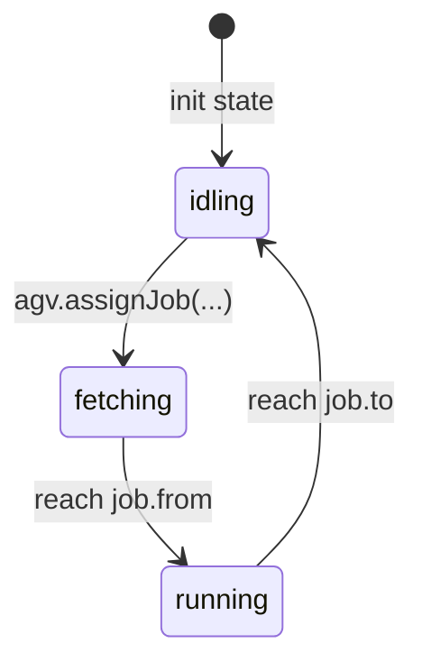

# state design

```mermaid
stateDiagram-v2
    [*] --> A: init state
    A --> B: agv.assignJob(...)
    B --> C: reach job.from
    C --> A: reach job.to

state "idling" as A
state "fetching" as B
state "running" as C
```
